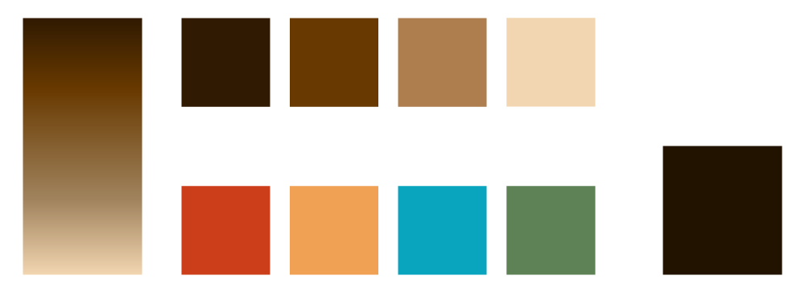

# 

**kafe** is your hub for all things coffee. From details on different brew methods to recipe calculators and other brew utilities, **kafe** is your source of all things coffee related.

## Table of Contents

- [App Proposal](#app-proposal)
  - [Problem](#the-problem)
  - [Feature List](#feature-list)
  - [Tools](#tools)
    - [React Framework](#react-framework)
    - [React Spring](#react-spring)
    - [Database](#database)
    - [TailwindCSS](#tailwindcss)
    - [TypeScript?](#typescript-v-javascript)
    - [Backend](#backend)
    - [Deployment](#deployment)
  - [Learning Goals](#learning-goals)
    - [Database Integration](#react-database-integration)
    - [Authentication](#react-authentication)
    - [Animation](#animation)
    - [Typescript](#typescript-1)
    - [Backend Integration](#backend-integration)
  - [Design](#design)
    - [Color](#color)
    - [Typography](#typography)

## App Proposal

### The Problem

As a former barista, I obsess over the coffee I brew at home. I want to produce the highest-quality possible coffee, but finding an ideal recipe is unusually difficult. There are recipes everywhere (websites for coffee suppliers, roasters, and coffee goods manufacturers, personal blogs, YouTube videos, etc.) which means you often have to search in many places to find the ideal recipe. There is also not a super standardized way of writing coffee recipes (some give you exact gram measurements of the coffee and the water, while some write in ratios of either grams of coffee:grams of water or grams of coffee per liter of water). I want **kafe** to be the first--and potentially only--place you look when you get a new Aeropress or decide to try a V60 for the first time and need information.

### Feature List

- Option One (Attainable)

  - Brew Methods
    - Details about different brew methods, their histories, equipment needed, etc.
    - Each brew method will also be accompanied with different recipes, which will link to the 'Brew Now' section
  - Drink Recipes
    - There will be a recipes that ship with the app of common coffee drink recipes (cafe au lait, latte, cappuccino, white Russian, etc.)
  - Utilities
    - 'Brew Now'
      - 'Quiz'-like form that allows users to input their roast, brew method, desired output, etc. to be given a recipe (coffee:water ratio, grind size, etc.) for optimal
    - Timer
      - Each 'Brew Now' result will also link to/include a brew timer that is customized to the brew method, recipe, and roast
  - Coffee Education
    - Learn about arabica vs. robusta beans, what different roasts should look like, what different grind sizes mean, how extraction works, etc.
  - Transparency
    - While not a feature, a major aim of this project is transparency. Sources will be cited everywhere, and links to the original content will be available for every entry, since this information is largely coming from varied sources across the internet.

- Option Two (Ambitious)
  - Everything from option one plus:
    - User Authentication
      - The user will be able to make an account and keep a list of favorites: recipes, brew methods, beans, roasts, etc.
        - There is a potential for a type of social element that would allow sharing of this information, but at the least, there will be a user profile view (toggleable by the user as public or private) where they can share their favorites with others outside of the app
      - Users can add their own recipes

        
### Tools

#### React Framework

When I initially started this app, I was planning on it being serverless and not having a database--erring more on the side of a reference tool than a dynamic application.

I was initially planning on using Vite for a single page application, but as the idea for the project has grown in complexity, I think I will use NextJS (which I have used previously in [my portfolio](https://j-par.com)).

#### React Spring

With [my last React app](https://j-par.com), I started using React Spring, and I plan to use it more deeply in **kafe** to provide a better UX with more dynamism to my application.

#### Database

Depending on which route I take with the scale of the app, I may or may not need a database. If I go for the more ambitious route, I will have to store all of the user data in a database, and the only one I've worked with in the past (for [museo](https://museo.onrender.com)) has been MongoDB.

If I go for the less-ambitious option, I can use `localStorage`.

#### TailwindCSS

I really have enjoyed Tailwind and the ease with which I can create beautiful UIs. I also enjoy/plan to use the custom theming potential of Tailwind.

#### TypeScript v. Javascript

TypeScript has been on my list of things to learn for a while now, and I think this could be a good opportunity to dive in.

I have a lot more experience with Javascript, but I have been interested in TypeScript for:

- its potential to minimize errors/clarify where/why they are happening
- its integration with Angular, which is a framework I would eventually like to learn
- its performance on the StackOverflow annual survey (it is both more loved and more wanted than JS)

#### Backend

I have enjoyed working with Express in the past (e.g., [museo](https://museo.onrender.com)), and would like to continue using it in this app. I am also considering using Firebase for its built in authentication tools which could simplify the learning curve for the more ambitious option.

#### Deployment

This app will likely be deployed with Vercel, which has become my go-to deployment/hosting service because of its ease of use.

### Learning Goals

#### React Database Integration

If I go the more ambitious route and decide to use MongoDB with **kafe**, this will be my first time integrating a React app with Mongo, which will be a good skill to learn moving forward.

#### React Authentication

As above, I will need to add authentication to my app if I go the more ambitious route, which would also be a first for me.

#### Typescript

I have never built an app using TypeScript, although it is definitely on the list of languages I would like to learn. It is a more desirable language (per StackOverflow's annual survey) than JS, and it would seem smart of me to learn this language as I'm preparing to enter the developer workforce. Completely anecdotally, as well, I have seen a huge number of job listings seeking TS experience, and I think it would open more potential doors for me.

#### Animation

I have very lightly dabbled in animation, but as a designer at heart, the appearance of my apps is very important to me. Because **kafe** will be very clean and minimal, animation will play a key role in making the experience feel sleek and modern. Animation can be very complex, and I think it will benefit me in finding a job to specialize in animation.

#### Backend Integration

I have never incorporated a backend to a React application before, so this, too, will take some learning, but it will also be an investment in my future as a developer.

### Design

**kafe** has its design rooted in Scandinavian coffee culture.

#### Color

- The colors of **kafe** will primarily draw upon the colors of coffee itself, with various shades of brown.
- For accent colors, it will draw upon the colors of the houses lining the fjords of Norway:
  - 

#### Typography

**kafe** will use Google's Roboto Flex variable font, with customized optical size (100), width (125), counter width (500), ascender height (700), descender depth (-150), and uppercase height (675). Bold will have a weight of 800, and standard body copy will have a weight of 400:

